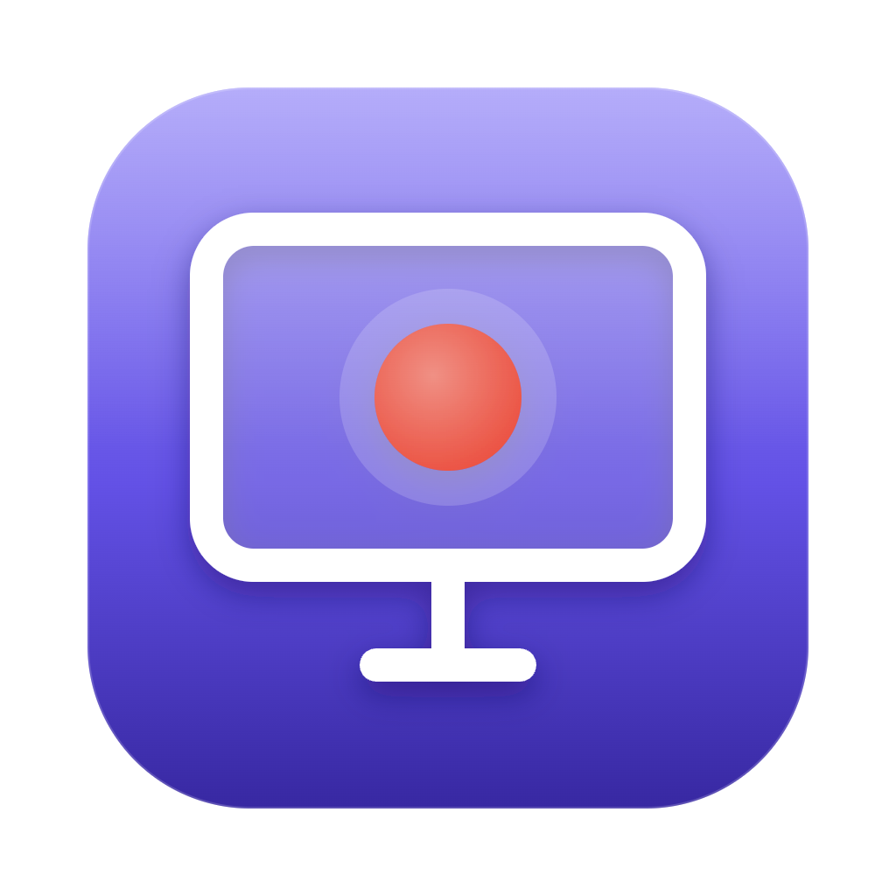
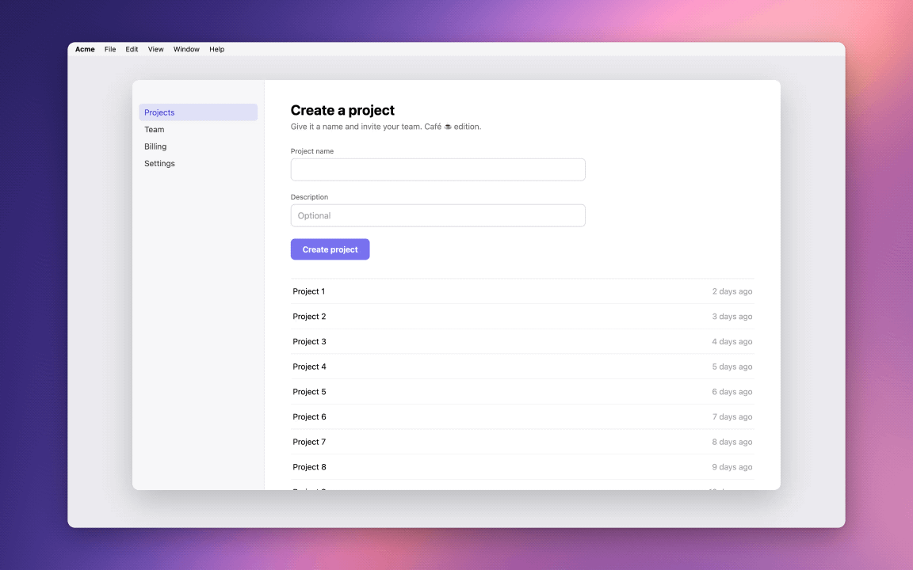
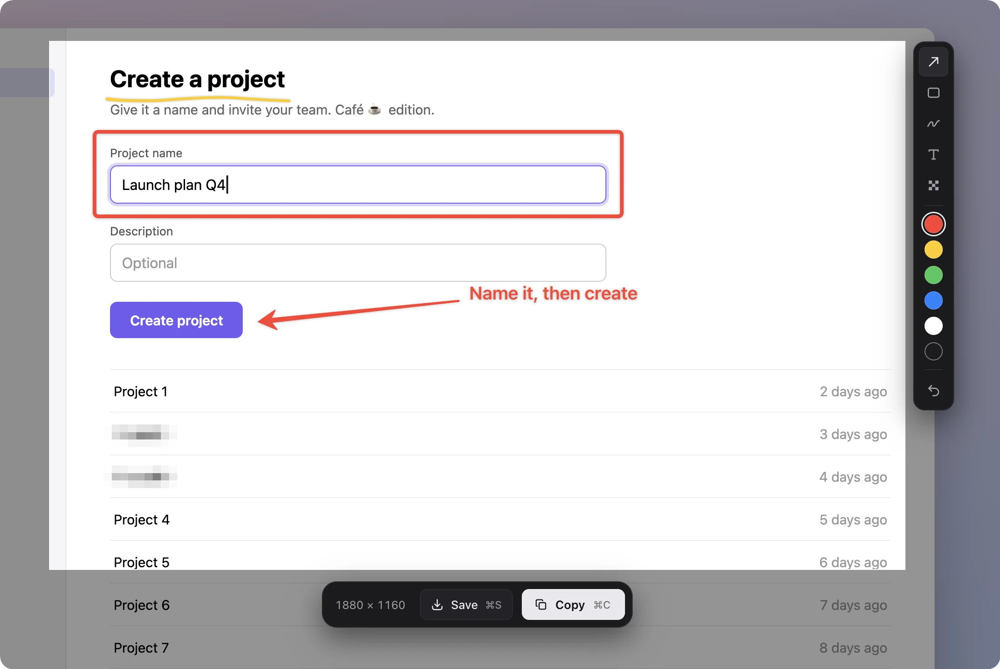
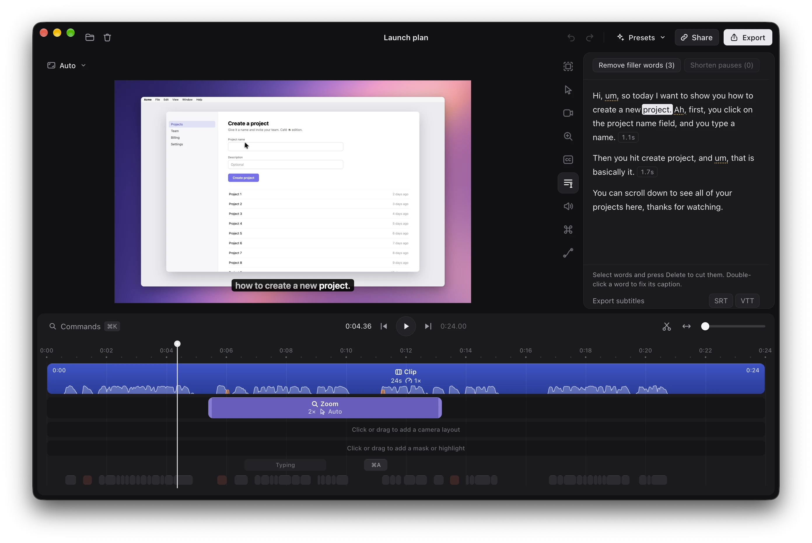
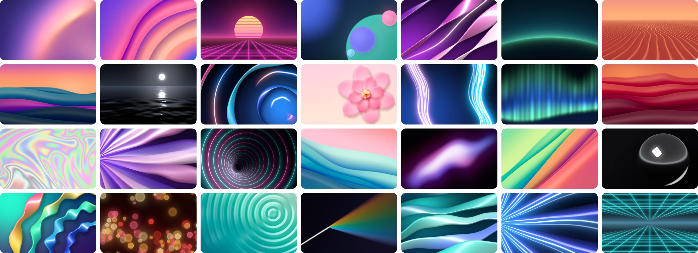

<p align="center">
  
</p>

<h1 align="center">Grip</h1>

<p align="center">
  <b>Record your screen. Get a polished video.</b><br>
  Auto-zoom, a smooth cursor, captions, screenshots, and one-click share.<br>
  A free and open source screen recorder and editor for the Mac.
</p>

<p align="center">
  <a href="https://github.com/bestboyhq/grip/releases/latest"></a>
</p>

<p align="center">
  <a href="https://github.com/bestboyhq/grip/releases/latest"></a>
  
  
  <a href="LICENSE"></a>
</p>

<p align="center">
  
</p>

<p align="center">
  <sub>Exported by Grip from a raw 24-second screen recording with voice-over.
  Zooms, cursor, and keycaps are automatic.
  The only edits: a wallpaper, captions on, filler words out.</sub>
</p>

---

Most screen recordings are hard to watch: a tiny cursor on a huge screen, nothing in focus, and a lot of "um".
Grip records your screen, camera, mic, and every click and keystroke on separate tracks, then directs the video for you.
It zooms where you click, follows where you type, redraws a smooth cursor, and writes captions on your Mac.
Nothing gets baked in, so every choice stays editable.

Need a screenshot instead?
The same keystroke grabs one, lets you mark it up, and puts it on your clipboard.

## Why Grip

- **Free and open source.** No subscription, no account, no watermark.
- **A screenshot tool built in.** Freeze the screen, draw arrows, boxes, ink, and text on top, pixelate what's private, and paste.
- **Everything runs on your Mac.** Recording, editing, transcription, background removal, and face tracking.
- **Nothing is baked in.** Raw tracks stay untouched, and every zoom, cut, and caption is an edit you can undo.
- **What you preview is what you export.** One GPU renderer and one audio graph draw both, frame for frame.
- **Your links, your server.** Share links come from a [small server](server) you host yourself.
- **Keyboard first.** One shortcut to capture, single keys to edit, `⌘K` for everything else, and `grip://` links for scripts.

### The usual screen recorder bugs, designed out

Each bug below shipped in a real screen recorder.
Grip designs them out from the first commit instead of patching them later.

| The usual bug | How Grip rules it out |
| --- | --- |
| Subtitles drift or ignore your cuts | Captions, zooms, keystrokes, and audio all map through **one shared time map** of cuts and speed changes. |
| Zooms shift when you trim the clip before them | Every timed item lives in **source time**, so a zoom stays on its moment however you cut around it. |
| The cursor is baked into the video | The screen is recorded **without the cursor**. Grip redraws it from the event stream. |
| The export doesn't match the preview | The frame at time *t* is a **pure function** of the project and *t*, drawn by the same renderer for both. |
| A crash or power loss eats the take | Tracks are written in fragments. An interrupted recording is **rebuilt at the next launch**. |
| A full disk corrupts the recording | Grip won't start with under 1 GB free, warns when space runs low, and **keeps what it wrote**. |
| `#` or emoji in a project name breaks a feature | Names like `Demo #1 ✨ café` are **in the test suite** and the demo project. |
| Long projects make the editor crawl | The timeline is checked against a **2-hour project** with 500 cuts, 300 zooms, and 20,000 caption words. |

## Capture in one keystroke

Press **⌥⌘↩︎** or click the menu bar icon.
The screen freezes under Grip's overlay, in the mode you used last, with your last area still selected.
Draw right on top of the frozen screen, then copy it, save it, or record it.

<p align="center">
  
</p>

<p align="center">
  <sub>One keystroke, a few marks, and ⌘C puts it on your clipboard.</sub>
</p>

- **Record it.** Press **↩︎** for a 3-2-1 countdown, then record.
  Or pick a whole display, one window, or an iPhone or iPad over USB.
- **Or screenshot it.** **⌘C** copies the area at once, **⌘S** saves it to the Desktop.
  Screenshots keep the Display P3 colors macOS uses.
- **Mark it up first.** Arrow, rectangle, pen, text, and pixelate, each on one key (**A R P T B**), in six colors.
  The pen draws smooth ink that thins with speed, or with pressure on a stylus.
  Drag any shape to move it, and undo covers every stroke.
- **Size it exactly.** Drag the handles, type a size, lock 16:9, 4:3, 1:1, or 9:16, or snap a window to a preset size.

### While you record

- **Camera, mic, and system audio on one clock**, so lips stay in sync for hours.
- **A camera bubble** in the corner of the area.
  Drag it, and the video puts your camera there too.
- **Draw on screen** with **⌥⇧⌘D**.
  The ink fades out on screen just as it will in the video.
- **Speaker notes** in a scrolling prompter only you can see.
- **Grip stays out of the shot.** Its windows never show up in the recording, and desktop icons can hide too.
- **Pause, resume, restart, or discard** a take, from the widget, the menu bar, or a shortcut.
- **Warnings that matter.** Grip tells you when your mic goes silent or disconnects, before the take is wasted.

### Then share it before you leave the flow

Every recording ends in a small result card:

- **Copy** an MP4 that fits under 20 MB, ready to paste into Slack, Discord, WhatsApp, or Mail.
- **GIF** under 10 MB, sized for GitHub READMEs and issues.
- **Link** to a share page that works before the upload even finishes.
- **Edit** to open the full editor.

Drag the preview straight into another app to drop the file.
**Recent Captures** in the menu bar reopens your last five screenshots and recordings.

## Polished by default

- **Auto-zoom.** Clicks and typing become zooms that follow your cursor.
  Each one is a plain timeline item you can move, retime, or switch off.
  Pick a smooth glide or a focused move that settles fast, or magnify in place with a glass loupe.
  Rather zoom by hand? Turn auto-zoom off for new recordings in Settings.
- **A cursor worth watching.** Redrawn from events: smoothed, passing exactly through every click, hidden when idle, with motion blur.
  Choose ripple, circle, or shockwave click effects, click sounds, a larger size, or a touch-style circle.
- **Keystrokes as keycaps.** Shortcuts appear as macOS keycaps in your own keyboard layout.
  Password fields stay private.
- **A voice that sounds produced.** Noise reduction, speech loudness normalized to -16 LUFS, and a limiter so nothing clips.
- **Captions written on your Mac.** NVIDIA Parakeet v3 transcribes 25 European languages on device, with timing for every word.
  Show them a line or a word at a time, fading or sliding in.
- **A clean frame, your call.** New recordings show the screen edge to edge.
  Pick a wallpaper and Grip adds the padding to show it, and one undo takes both back.
  Rounded corners and a soft shadow are a slider away.

## Edit a video like a doc

<p align="center">
  
</p>

- **Edit by transcript.** Select words and press Delete, and the video follows.
  Grip finds filler words and long pauses: remove the fillers or shorten the pauses in one click.
  Double-click a word to fix its caption.
- **A keyboard-first timeline.** `C` cuts, `X` ripple-deletes, `Z` adds a zoom, and `⌘K` reaches every action.
  Copy, paste, duplicate, merge clips, or bring back anything you cut.
- **Speed without chipmunks.** Any clip from 0.25× to 8×, with pitch-preserving time-stretch.
- **Per-clip volume** from muted to 200%, plus a background music track under the mix.
- **Camera layouts.** Picture-in-picture, fullscreen, split screen, or hidden, animated as they change.
- **Masks.** Blur or pixelate anything sensitive, or highlight what matters.
  Masks stay locked to the content through zooms.
- **Safe by default.** Your raw recording never changes.
  Edits are autosaved as you go, and undo covers every one.

## Make it yours

<p align="center">
  
</p>

- **185 wallpapers** in 8 collections: Soft, Spring, Sunset, Radiant, Energy, Iridescent, Midnight, and Neon.
  Each one is drawn live on the GPU, so it stays sharp at any size and in any format.
  Or use your macOS wallpapers, a gradient, a color, or any image, with optional blur.
- **Device frames** for MacBook, iPhone, and iPad.
- **Every format:** 16:9, 9:16, 4:5, 1:1, or custom.
  Narrow formats follow the cursor.
- **Camera styles:** circle, rounded, or square, mirrored or not, with background removal, face tracking, and hide when silent.
  Grade it with a built-in look or your own `.cube` LUT.
- **Presets** save a whole look as a portable `.grippreset` file, images included.

## Export and share

- **MP4** in H.264 or HEVC, from 720p to 4K at 30 or 60 fps, hardware encoded.
  Set a size limit and Grip fits the file under it.
- **GIF** with per-scene palettes, so colors don't flicker, plus a loop count and a size target.
- **To a file, the clipboard, or a link.** Exports queue up in the background while you keep editing, and batch export renders many projects in one go.
- **Subtitles** as SRT or VTT, aligned through every cut and speed change.
- **Share links** with timestamped comments, private links, and view counts.
  Uploads resume after a lost connection or a restart.
  Share the whole editable project too: the other side opens it in Grip with one link.

## Private by design

Recording, editing, transcription, and background removal all run on your Mac.
There is no account and no telemetry, and crash reports stay on your disk.
Grip goes online only to download the speech model once (about 670 MB), to check for updates, and to upload when you share.

Grip lives in the menu bar.
Updates download in the background and install themselves while you're away, never during a recording or an export.

## Shortcuts

| Anywhere | |
| --- | --- |
| **⌥⌘↩︎** | Capture: open the picker, or finish the recording (change it in Settings) |
| **⌥⇧⌘P** | Pause or resume |
| **⌥⇧⌘D** | Draw on screen while recording |
| **⌥⇧⌘⌫** | Discard the recording |
| **⌥⌘.** | Start or stop the speaker notes prompter |

| In the picker | |
| --- | --- |
| **↩︎** | Record the area |
| **⌘C** / **⌘S** | Copy the screenshot / save it to the Desktop |
| **A R P T B** | Arrow, rectangle, pen, text, pixelate |
| **Esc** | Close the picker |

| In the editor | |
| --- | --- |
| **Space** | Play or pause |
| **C** or **⌘B** | Cut at the playhead |
| **S** or hold **⌥** | Split tool |
| **X** | Ripple delete |
| **Z** / **1**-**9**, **0** / **E** | Add a zoom / set its level from 1.5× to 6× / switch it on or off |
| **L** / **M** | Add a camera layout / mute a clip |
| **← →** / **↑ ↓** | Step 0.5 s (1 s with **⇧**) / jump between cuts |
| **⌘C** / **⌘V** / **⌘D** | Copy / paste at the playhead / duplicate |
| **⌘=** / **⌘-** / **⌘0** | Zoom the timeline in / out / to fit |
| **⌘E** | Export |
| **⌘K** | Command menu: every action, searchable |

Automate Grip from Raycast, Shortcuts, or a script with `grip://` links:

```sh
open "grip://record?mode=area"   # also display, window, device; no mode opens the last one
open "grip://stop"
open "grip://open?path=/Users/me/Movies/Demo.grip"
open "grip://open?url=https://share.example.com/v/abc123"   # a shared project
```

## Under the hood

Grip is built on three rules, so the bugs typical of screen recorders cannot happen by design.

- **Raw sources, separate tracks.** Screen without the cursor, camera, mic, system audio, and the input event stream.
  The cursor is redrawn from events, which is what makes smoothing, hiding, and click effects possible.
- **One time map.** Every zoom, caption word, and keystroke lives in source time and maps to the output through one shared map of cuts and speed changes.
  Captions and audio stay in sync after hundreds of cuts.
- **Pure render.** The frame at time *t* is a function of the project and *t*.
  Preview and export share one WebGPU renderer and one audio graph, so the export matches the preview frame for frame.

The stack: Electron and Svelte 5 for the app, a Rust addon (napi-rs, objc2) for ScreenCaptureKit, AVFoundation, CoreGraphics event taps, and Vision, a WebGPU compositor, WebCodecs with VideoToolbox for decoding and encoding, and [mediabunny](https://github.com/Vanilagy/mediabunny) for muxing.

## Build from source

You need macOS 15 or later on Apple silicon, Node 24, Rust, and the Xcode command line tools.

```sh
git clone https://github.com/bestboyhq/grip && cd grip
npm ci
npm run build:native   # the Rust addon
npm run dev            # the app, with hot reload
```

No time to record? Generate a 24-second demo project (needs `ffmpeg`) and open it:

```sh
npx electron scripts/fixture/make.ts
npm run dev -- --open ".context/fixtures/Demo #1 ✨ café.grip"
```

Run the checks with `npm test`, `npm run check`, and `cd native && cargo test`.

### Host your own share server

```sh
STUDIO_SHARE_URL=https://share.example.com STUDIO_SHARE_UPLOAD_KEY=<secret> npm run server
```

It runs on plain Node, listens on port 7433 (`PORT` changes it), and stores items in `STUDIO_SHARE_DATA`.
Set the upload key before exposing it beyond localhost.

## Contributing

Issues and pull requests are welcome.
Read [AGENTS.md](AGENTS.md) for the invariants and the code style, and the skill in [`.agents/skills/`](.agents/skills) for the area you touch: each one lists what screen recorders in that area usually get wrong.
Pull request titles follow [Conventional Commits](https://www.conventionalcommits.org), and every merged `feat` or `fix` ships to users as an in-app update.

## License

[AGPL-3.0](LICENSE)
